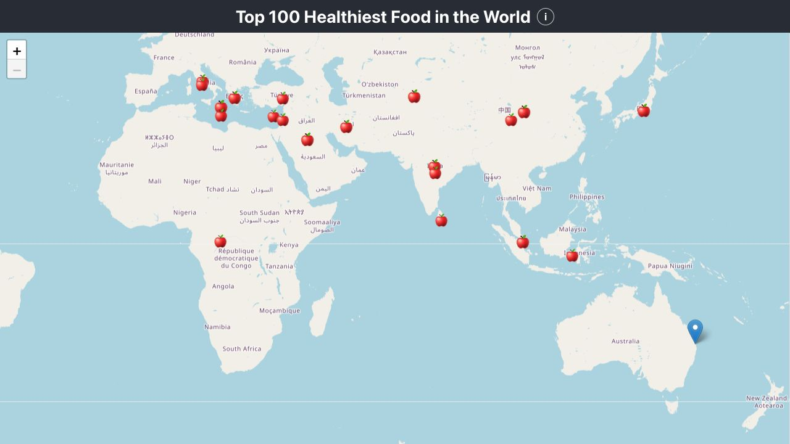
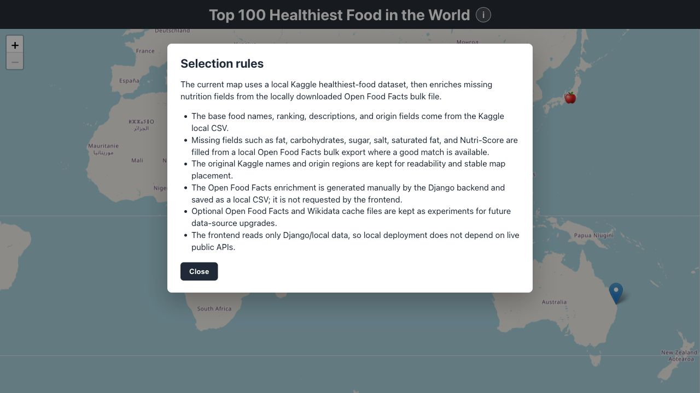
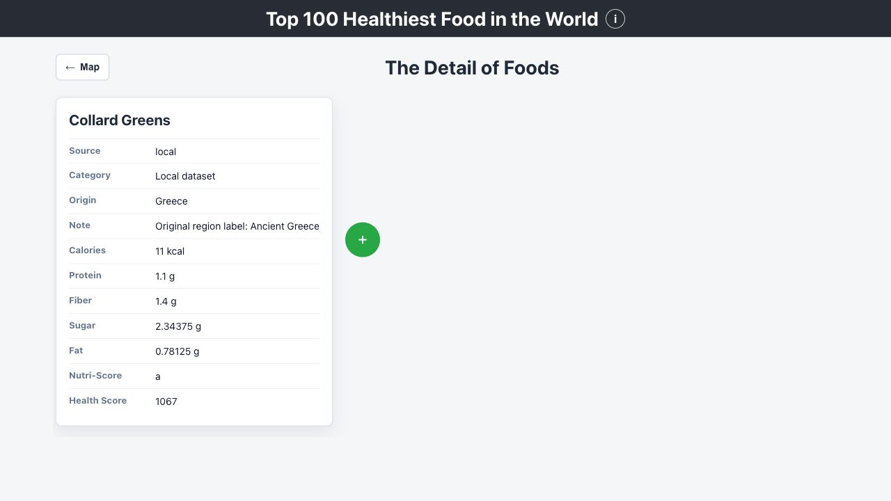
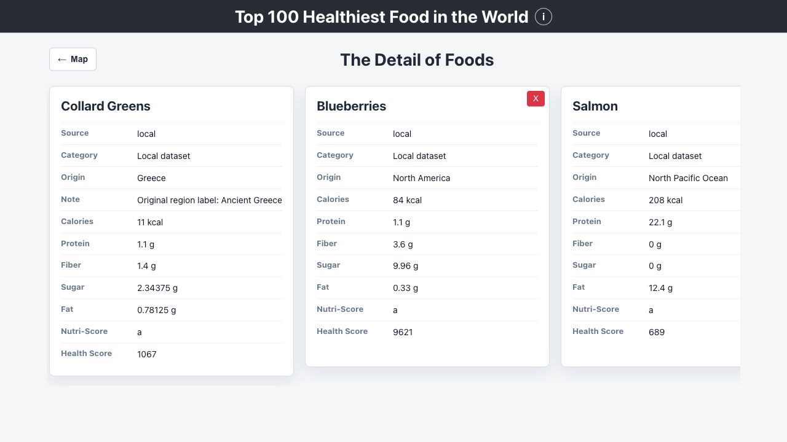

# INFS3208 Individual Project - Top 100 Healthiest Food Map
## INFS3208 个人项目 - 全球最健康食物地图

---

### About / 项目简介

This project is a React + Django web app originally built for INFS3208 at The University of Queensland. It shows healthy foods on a Leaflet world map and provides a details page for nutrition comparison.

这是一个最初为昆士兰大学 INFS3208 课程开发的 React + Django 全栈项目。应用使用 Leaflet 世界地图展示健康食品，并提供详情页用于查看和对比营养信息。

The current default data flow keeps the original Kaggle healthiest-food CSV as the primary local database. Missing nutrition fields are enriched offline from a locally downloaded Open Food Facts bulk export.

当前默认数据流程以 Kaggle healthiest-food CSV 作为主要本地数据库。缺失的营养字段会通过已下载到本地的 Open Food Facts bulk 数据离线补齐。

```text
Kaggle local CSV
        ↓
Django local formatter
        ↓
Open Food Facts bulk enrichment command
        ↓
enriched local CSV
        ↓
Django JSON API
        ↓
React + Leaflet frontend
```

The frontend never calls Open Food Facts or Wikidata directly. Public data sources are handled manually by backend commands and saved locally.

前端不会直接请求 Open Food Facts 或 Wikidata。公共数据源只由后端命令手动处理，并保存为本地文件。

---

### Tech Stack / 技术栈

| Layer / 层级 | Technology / 技术 |
|---|---|
| Frontend / 前端 | React, React Router, Leaflet |
| Backend / 后端 | Django, Django REST Framework |
| Local Data / 本地数据 | CSV, optional SQLite cache |
| Data Sources / 数据源 | Kaggle local dataset, Open Food Facts bulk export, optional Wikidata |
| Deployment / 部署 | Docker, Docker Compose, local dev server |

---

### Current Data Files / 当前数据文件

| File / 文件 | Purpose / 用途 |
|---|---|
| `data/top_100_fruits.csv` | Original Kaggle/local coursework dataset / 原始 Kaggle/课程本地数据 |
| `data/top_100_fruits_off_enriched.csv` | Current preferred local CSV with Open Food Facts nutrition enrichment / 当前优先使用的本地增强 CSV |
| `data/en.openfoodfacts.org.products.csv.gz` | Local Open Food Facts bulk export used for offline enrichment / 用于离线补齐的 OFF bulk 压缩包 |
| `data/region_coordinates.csv` | Country/region coordinate lookup table / 国家和地区坐标表 |
| `data/openfoodfacts_*.csv` | Experimental generated Open Food Facts cache files / 实验性的 OFF 生成缓存 |

The app uses `top_100_fruits_off_enriched.csv` when it exists. If it is missing, Django falls back to `top_100_fruits.csv`.

如果 `top_100_fruits_off_enriched.csv` 存在，应用会优先读取它；否则 Django 会回退到 `top_100_fruits.csv`。

---

### Features / 功能特点

1. **Interactive Food Map / 交互式食品地图**  
   Shows available food origin coordinates with Leaflet markers.
   
   使用 Leaflet marker 展示食品产地或可用坐标。

2. **Local-First Data / 本地优先数据**  
   The base food names, ranking, descriptions, quantities, antioxidant scores, and origin labels come from the Kaggle/local CSV.
   
   食品名称、排序、描述、份量、抗氧化分数和原产地标签来自 Kaggle/本地 CSV。

3. **Offline Open Food Facts Enrichment / 离线 OFF 补齐**  
   A Django command scans the local Open Food Facts bulk file and fills missing fat, carbohydrates, sugar, salt, saturated fat, Nutri-Score, image URL, and matching metadata.
   
   Django 命令会扫描本地 Open Food Facts bulk 文件，并补齐 fat、carbohydrates、sugar、salt、saturated fat、Nutri-Score、图片链接和匹配元数据。

4. **Details and Comparison / 详情与对比**  
   The detail page supports returning to the map and adding comparison cards horizontally.
   
   详情页支持返回地图，并可以横向添加食品对比卡片。

5. **No Frontend Public API Calls / 前端不直接调用公共 API**  
   React reads Django endpoints only, so the app remains usable in local/offline deployment.
   
   React 只读取 Django 接口，因此本地或离线部署时仍可使用。

---

### Screenshots / 项目截图

#### Home Map / 首页地图



The main page displays food origin markers on a Leaflet world map. Each marker opens a popup with the food name, origin region, data source, and a link to the details page.

首页使用 Leaflet 世界地图展示食品原产地 marker。点击 marker 后会显示食品名称、原产地、数据来源，并可进入详情页。

#### Data Methodology / 数据规则说明



The information modal explains how the current dataset is selected, cleaned, enriched, and kept local-first.

信息弹窗说明当前数据集如何筛选、清洗、补齐，并解释为什么采用本地优先的数据流程。

#### Food Details / 食品详情



The details page shows the selected food's source, category, origin note, nutrition values, Nutri-Score, and health score.

详情页展示选中食品的数据来源、分类、原产地说明、营养字段、Nutri-Score 和健康分数。

#### Food Comparison / 食品横向对比



The comparison view lets users add foods side by side, making it easier to compare calories, protein, fiber, sugar, fat, Nutri-Score, and health score.

对比视图支持横向添加多个食品卡片，方便比较热量、蛋白质、纤维、糖、脂肪、Nutri-Score 和健康分数。

---

### Project Structure / 项目结构

```text
Individual Project/
├── backend/
│   ├── api/
│   │   ├── food_formatters.py
│   │   ├── food_store.py
│   │   ├── management/commands/
│   │   │   ├── enrich_local_foods_from_off.py
│   │   │   ├── clean_openfoodfacts_bulk.py
│   │   │   ├── enrich_food_taxonomy.py
│   │   │   ├── sync_openfoodfacts.py
│   │   │   └── sync_wikidata_origins.py
│   │   ├── urls.py
│   │   └── views.py
│   ├── data/
│   ├── scripts/
│   ├── mysite/
│   └── manage.py
│
├── my-app/
│   ├── src/
│   │   ├── components/
│   │   ├── data/
│   │   └── App.js
│   └── package.json
│
├── data/
│   ├── top_100_fruits.csv
│   ├── top_100_fruits_off_enriched.csv
│   ├── en.openfoodfacts.org.products.csv.gz
│   └── region_coordinates.csv
│
├── project_screenshots/
│   ├── 01-home-map.png
│   ├── 02-data-methodology.png
│   ├── 03-food-details.png
│   └── 04-food-comparison.png
│
├── LOCAL_RUN.md
└── README.md
```

---

### Data Preparation / 数据准备

To regenerate the current preferred local enriched CSV:

如需重新生成当前优先使用的本地增强 CSV：

```bash
cd backend
python3 manage.py enrich_local_foods_from_off \
  --local ../data/top_100_fruits.csv \
  --off ../data/en.openfoodfacts.org.products.csv.gz \
  --output ../data/top_100_fruits_off_enriched.csv
```

This command is fully local. It scans the downloaded Open Food Facts bulk archive and does not call the live Open Food Facts API.

该命令完全在本地运行，只扫描已下载的 Open Food Facts bulk 压缩包，不会访问实时 OFF API。

Optional experimental commands:

可选实验命令：

```bash
cd backend
python3 manage.py clean_openfoodfacts_bulk
python3 manage.py enrich_food_taxonomy
python3 manage.py sync_wikidata_origins --limit 100
```

These commands are kept for future data-source upgrades. The main app does not require them for normal local operation.

这些命令保留给未来的数据源升级使用，当前主应用的本地运行不依赖它们。

---

### API Endpoints / API 接口

| Endpoint / 接口 | Description / 说明 |
|---|---|
| `/api/food-data/` | Returns the preferred local/enriched data, with fallback support / 返回优先本地增强数据，并支持回退 |
| `/api/food-data/?source=local` | Forces the local CSV data path / 强制使用本地 CSV 数据路径 |
| `/api/food-data/?source=map` | Returns food data with map-ready positions / 返回带地图坐标的食品数据 |
| `/api/fruit-data/` | Legacy alias for `/api/food-data/` / 旧接口别名 |

---

### Run Locally / 本地运行

Start Django:

启动 Django：

```bash
cd backend
DJANGO_SETTINGS_MODULE=mysite.settings_local python3 manage.py runserver 127.0.0.1:8000 --noreload
```

Start React:

启动 React：

```bash
cd my-app
npm install
npm start
```

Local URLs:

本地访问地址：

```text
Frontend / 前端: http://localhost:3001
Backend API / 后端 API: http://localhost:8000
```

---

### Docker / Docker 运行

```bash
docker-compose up -d
```

If the enriched CSV is not present, the backend will still use the original Kaggle CSV fallback.

如果增强 CSV 不存在，后端仍会使用原始 Kaggle CSV 回退数据。

---

### Data Notes / 数据说明

The Kaggle/local CSV gives the project a stable curated food list and origin labels, which are better for the map presentation than raw product-level Open Food Facts rows.

Kaggle/本地 CSV 提供了稳定的精选食品列表和原产地标签，比直接使用商品级 OFF 数据更适合地图展示。

Open Food Facts is used as an offline enrichment source. Because it is product-level data, matching is approximate and the original Kaggle food name remains the display name.

Open Food Facts 被用作离线补齐来源。由于 OFF 是商品级数据，匹配会有近似性，因此页面仍保留 Kaggle 食品名作为展示名。

Wikidata support is optional and experimental. It is not queried during normal page loads.

Wikidata 支持是可选实验功能，普通页面加载时不会请求 Wikidata。

---

### Reflection / 反思

Through this project, I learned how to connect a React frontend with a Django backend, design JSON endpoints, work with local data cleaning, and keep a frontend independent from live public API availability.

通过这个项目，我学习了如何连接 React 前端与 Django 后端、设计 JSON 接口、处理本地数据清洗，并让前端不依赖公共 API 的实时可用性。

The upgraded version also shows a practical local-first workflow: keep a curated dataset for presentation, enrich missing fields offline, and preserve optional experimental data pipelines for future improvements.

升级后的版本也展示了更实用的本地优先流程：保留适合展示的精选数据集，离线补齐缺失字段，并保留可选实验数据管线用于未来改进。

---

### Contact / 联系方式

- **Name / 姓名:** 黄杰鹏 (Jiepeng Huang)
- **Student ID / 学号:** 47352580
- **Course / 课程:** INFS3208 - Web Information Processing
- **University / 学校:** The University of Queensland

---

*Last updated: June 2026 / 最后更新：2026 年 6 月*
